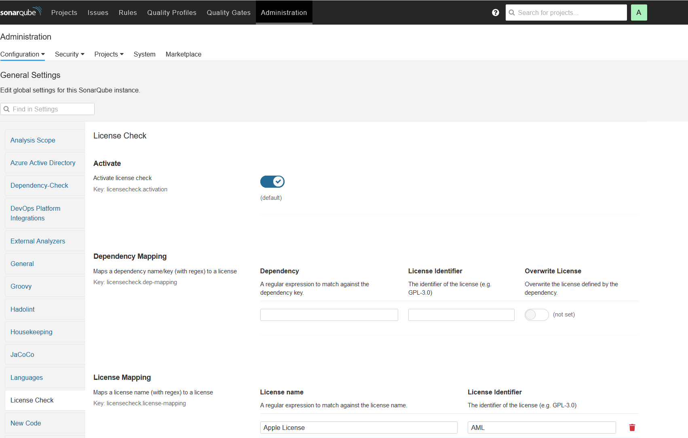
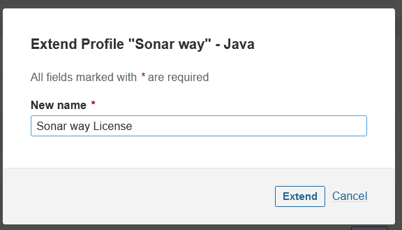
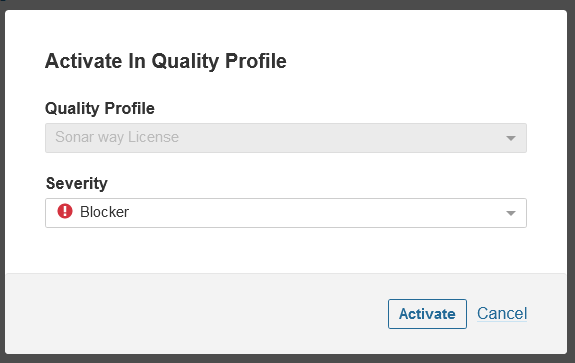

SonarQube License-Check
===================

This [SonarQube](http://www.sonarqube.org/) plugin ensures that projects use dependencies with compliant licenses. All dependencies and licenses can be viewed per projects and exported to Excel XLS. This enables a simple governance of dependencies and licenses for the whole organization.

## License

This software is licensed under the [Apache Software License, Version 2.0](http://www.apache.org/licenses/LICENSE-2.0.txt)

## Compatibility

This plugin is compatible:

 * 5.x version with 8.9 LTS and <= 9.5.x
 * 4.x version with SonarQube 8.x
 * 3.x version with SonarQube >= 7.9 LTS and < 8.
 * 2.x version with SonarQube >= 6.5 and < 7.
 * 1.x versions with SonarQube >= 5.3 and < 6.

For all changes see [CHANGELOG.md](CHANGELOG.md)

## Installation

Put the pre-built jar-file (from release downloads) in the directory `$SONARQUBE_HOME/extensions/plugins` and
restart the server to install the plugin. Activate the rules of this plugin ("License is not allowed", "Dependency has unknown license") in your SonarQube quality profiles - otherwise the plugin is not executed.

## Execution

When a project is analyzed using the `mvn sonar:sonar` in command line the extension is started automatically.

Please make sure to have all dependencies installed before launching the SonarQube analysis. So your complete build
should look something like this:

    mvn -B org.jacoco:jacoco-maven-plugin:prepare-agent -Dmaven.test.failure.ignore install
    mvn -B sonar:sonar

## Configuration

## General Configuration
After booting the SonarQube Server with the License-Check Plugin be found in the tab <b>Administration</b>.

* Within the <b>General Settings</b> and <b>License Check</b> you find the settings for the plugin.
* Within the general settings the plugin can be manually enabled or disabled. By default, it is enabled.
  * Under "Dependency Mapping" you can map  a dependency name/key (with regex) to a license, e.g. `^asm:asm$` to "BSD-3-Clause"
  * Under "License Mapping" you can  map a license name (with regex) to a license, e.g. `.*Apache.*2.*` to "Apache-2.0".

  * Under "Licenses" you can allow or disallow licenses globally and add/edit the list of known licenses.

  * Under "Project Licenses" you can allow and disallow licenses for a specific project.

## Activation rules in Quality Profile
You have also to activate the new rules in a (new) quality profile, for each supported language (java, js, groovy, kotlin) And you have to use this profile for your project.

<b>Step 1</b>

<b>Step 2</b>

<b>Step 3</b>

<b>Step 4</b>

<b>Step 5</b>

<b>Step 6</b>

<b>Step 7</b>

### Maven

Maven works if your project/module has a `pom.xml` on its root level (running with Maven, Gradle or SonarScanner).

### NPM

NPM works if your project/module has a `package.json` on its root level (running with Maven, Gradle or SonarScanner).

### Gradle

Gradle project should use JK1 plugin https://github.com/jk1/Gradle-License-Report

Note: Please check above link for instructions or follow as mentioned below

**Step1:** Update `build.gradle` file with following code for using JK1 plugin

    import com.github.jk1.license.filter.LicenseBundleNormalizer
    import com.github.jk1.license.render.JsonReportRenderer

    plugins {
      id 'com.github.jk1.dependency-license-report' version '1.13'
    }

    licenseReport {
        allowedLicensesFile = new File("$projectDir/src/main/resources/licenses/allowed-licenses.json")
        renderers = new JsonReportRenderer('license-details.json', false)
        filters = [new LicenseBundleNormalizer()]
    }

**Step 2:** Update `build.gradle` file with following code for using SonarQube plugin

    plugins {
        id 'org.sonarqube' version "3.0"
    }

    jar {
        enabled = true
    }

    sonarqube {
        properties {
            property "sonar.host.url", "http://localhost:9000"
        }
    }

**Step 3:** run following command  to generate your report `license-details.json` in  `build/reports/dependency-license`

    > gradle generateLicenseReport

**Step 4:** run following command for SonarQube

    > gradle sonarqube

## Features

### Analysis

The plugin scans for dependencies defined in your project including all transitive dependencies.

Currently, supported formats are:
* Maven POM files - all dependencies with scope "compile" and "runtime" are checked
* NPM package.json files - all dependencies (except "devDependencies") are checked
  * Note that transitive dependencies are _not_ scanned unless `licensecheck.npm.resolvetransitive` is set to `true`.

### Project Dashboard

The plugin contains a project dashboard showing a list of dependencies with version and a list of all used licences. Each table shows the status of the license
(allowed, not allowed, not found). You can also export the data to Excel.

